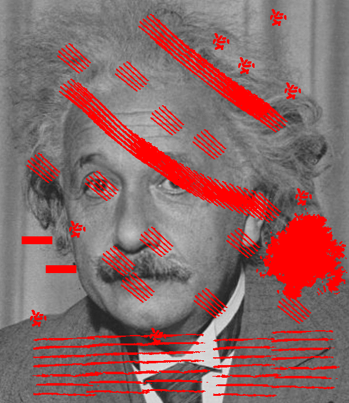

# Poisson_ImageEdit

## Part1 Poisson Image Completion
|Target Image| With stains |
|---|---|
|||

### Result
|Result|Compare with PS|
|---|---|
|||

## Part2 Poisson Seamless Cloning
|Source image| Source mask | Target image|
|---|---|---|
|||

### Result
|Result|Compare with PS|
|---|---|
|||